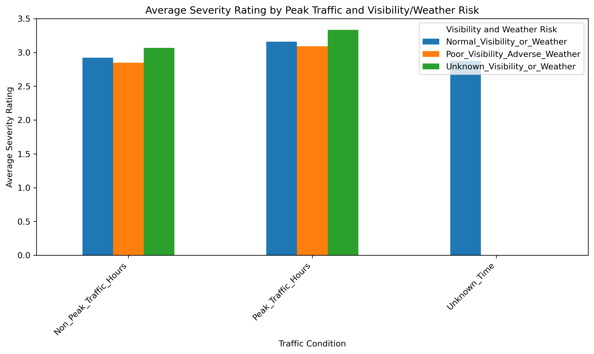
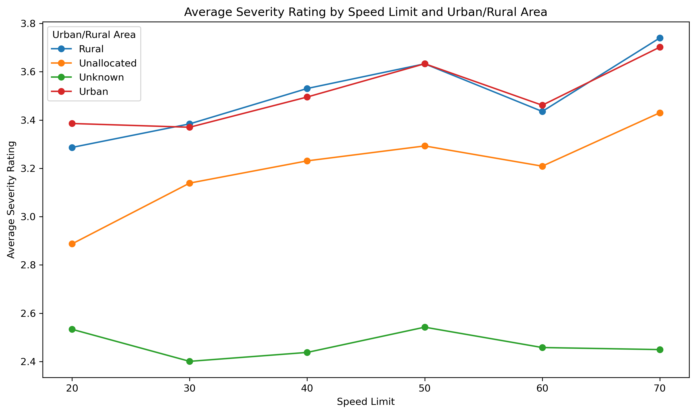

# Road Accident Big Data Pipeline

An end-to-end big data project for analysing road accident records, training accident severity prediction models, and extending the workflow into a real-time Kafka and Spark Structured Streaming pipeline.

The project combines two connected stages:

1. Batch analytics and machine learning with PySpark.
2. Streaming event processing with Kafka, Spark Structured Streaming, and a Python consumer visualisation layer.

## Project Overview

Road accident analysis often requires joining multiple high-volume datasets, handling noisy categorical and numerical fields, and producing insights that are useful for safety monitoring. This project works with collision, casualty, vehicle, and severity datasets to explore accident patterns and build a machine learning pipeline for severity prediction.

The second stage simulates incoming road accident events through Kafka, processes those events using Spark Structured Streaming, and produces near-real-time outputs for severity monitoring and visual analysis.

## Key Features

- Large-scale data loading and transformation with PySpark.
- Feature engineering across collision, casualty, vehicle, location, road, and weather attributes.
- Exploratory analysis of accident severity, visibility, weather, speed limits, and urban/rural patterns.
- Spark ML pipelines using indexers, one-hot encoding, vector assembly, and tree-based regression models.
- Hyperparameter tuning and model evaluation with Spark MLlib.
- Kafka producer for simulated accident event streams.
- Spark Structured Streaming pipeline for processing live collision and vehicle data.
- Streaming consumer notebook for visualising processed event outputs.

## Tech Stack

- Python
- PySpark
- Spark SQL
- Spark MLlib
- Spark Structured Streaming
- Apache Kafka
- Pandas
- Matplotlib
- Seaborn
- Folium
- Jupyter Notebook

## Repository Structure

```text
road-accident-big-data-pipeline/
├── README.md
├── .gitignore
├── notebooks/
│   ├── 01_batch_accident_severity_modeling.ipynb
│   ├── 02_kafka_accident_event_producer.ipynb
│   ├── 03_spark_structured_streaming_pipeline.ipynb
│   └── 04_streaming_consumer_visualisation.ipynb
├── data/
│   ├── batch_sample/
│   │   ├── a2_accidents.csv
│   │   ├── a2_collision.csv
│   │   ├── a2_vehicle.csv
│   │   └── severity_rating.csv
│   └── streaming/
│       ├── streaming_collision.csv
│       └── vehicle.csv
├── docs/
│   └── a2_metadata.xlsx
└── images/
    ├── peak_visibility_weather.png
    └── speed_limit_urban_rural.png
```

## Notebooks

### 1. Batch Accident Severity Modeling

`notebooks/01_batch_accident_severity_modeling.ipynb`

This notebook performs the batch analytics workflow:

- Loads collision, casualty, vehicle, and severity datasets.
- Cleans and transforms raw accident records.
- Creates derived features for modelling.
- Explores relationships between accident severity and factors such as weather, visibility, road type, speed limit, and area type.
- Builds Spark ML pipelines for severity prediction.
- Compares model performance and tunes hyperparameters.

### 2. Kafka Accident Event Producer

`notebooks/02_kafka_accident_event_producer.ipynb`

This notebook simulates streaming accident records by publishing collision and vehicle events to Kafka topics.

### 3. Spark Structured Streaming Pipeline

`notebooks/03_spark_structured_streaming_pipeline.ipynb`

This notebook consumes Kafka event streams using Spark Structured Streaming, applies schemas and transformations, joins streaming accident data, and writes query outputs for monitoring.

### 4. Streaming Consumer Visualisation

`notebooks/04_streaming_consumer_visualisation.ipynb`

This notebook consumes processed streaming outputs and visualises accident patterns using Python plotting and mapping tools.

## Data Notes

The original batch datasets are large and are not committed to this repository. Instead, `data/batch_sample/` contains 1,000-row sample extracts for each major batch file so the schema and workflow are visible on GitHub.

The smaller streaming datasets are included under `data/streaming/` because they are lightweight and useful for demonstrating the Kafka and Spark streaming workflow.

Generated Spark checkpoints, parquet outputs, trained model artifacts, notebook checkpoints, and submission zip files are intentionally excluded from version control.

## Example Visuals

### Peak Visibility and Weather Conditions



### Speed Limit by Urban and Rural Areas



## How To Run

This project expects a local big-data environment with Spark, PySpark, Kafka, and Jupyter Notebook configured.

A typical workflow is:

1. Start Kafka and create the required topics.
2. Open the notebooks in Jupyter.
3. Run `01_batch_accident_severity_modeling.ipynb` for batch analysis and modelling.
4. Run `02_kafka_accident_event_producer.ipynb` to publish simulated events.
5. Run `03_spark_structured_streaming_pipeline.ipynb` to process the stream.
6. Run `04_streaming_consumer_visualisation.ipynb` to inspect streaming outputs.

The notebooks may need path adjustments depending on where the full raw datasets and Spark output directories are stored locally.

## Portfolio Summary

This project demonstrates practical big-data engineering and analytics skills across both batch and streaming workflows. It combines distributed data processing, feature engineering, machine learning, Kafka-based event simulation, structured streaming, and visual analytics in a single road safety use case.

